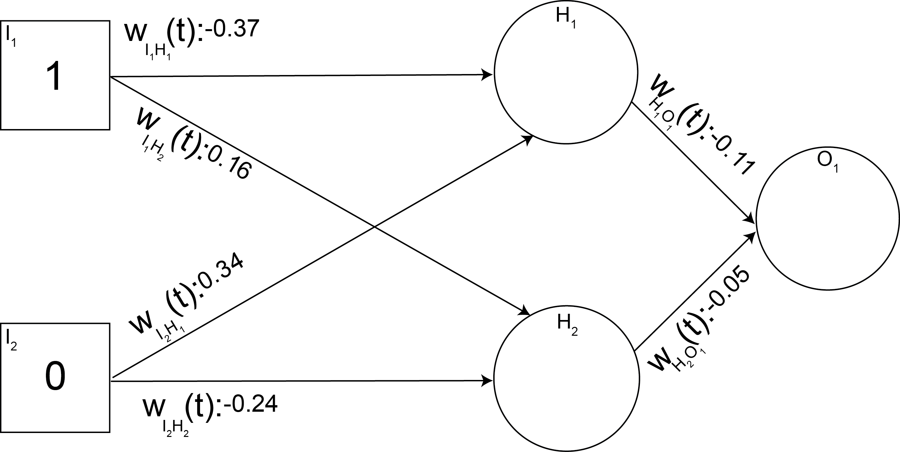

#### Name:

# Neural Nets: Practicing neural net error prop & learning
#### (NN Assignment # 1)

**Note: This assignment will be submitted via canvas!** You print out then write on the assignment, write the answers on a piece of paper, use a tablet, etc. Whatever you use, make sure it's legible and we can understand what you're writing. If we can't understand it, you won't get credit for it (and your grade will reflect that issue!)

### Given the following initial network configuration and target function, name the weights of the network after one full epoch, when using incremental learning
### Work alone for this exercise.

## Target Function: XOR w/ two inputs

| Input 1 | Input 2 | Output |
| :-----: | :-----: | :----: |
|    0    |    0    |    0   |
|    0    |    1    |    1   |
|  **1**  |  **0**  |  **1** |
|    1    |    1    |    0   |

- Input nodes: 2
- Hidden Layers: 1, Hidden nodes: 2
- Output nodes: 1
- **I**1: **1**, **I**2: **0**
- Weights: -0.37, 0.16, 0.34, -0.24; -0.11, -0.05
- &alpha; : 0.2
- All bias (or &theta;) : 0
- Node's activation function: Sigmoid function

&nbsp;

<!--
&nbsp;
-->

| Connection | Weight |
| :--------: | :----: |
| WI1H1(t+1) | |
| WI1H2(t+1) | |
| WI2H1(t+1) | |
| WI2H2(t+1) | |
| WH1O1(t+1) | |
| WH2O1(t+1) | |

## Grading
This assignment will be graded under the following rubric. Maximum number of points on this assignment is 10 points

**10 pts**: All answers correct and all work shown for answers

**8 pts**: Incorrect answer with only 1-2 errors shown as the issue

**6 pts**: Incorrect answer with > 1-2 errors shown as the issue
OR
**6 pts**: All correct answers with little to no work shown

**3 pts**: Incorrect answer shown with little work shown

**1 pt**: You wrote some stuff and submitted it